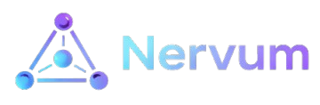

# Nervum – Environment Maps UI (SaaS frontend)



**Nervum** is a SaaS for visualizing and managing your software environments as a living map – services, databases, queues, and the relationships between them. This repository contains the **React frontend** (`nervum-ui`) that your users interact with in the browser.

It talks to the Go API in [`nervum-go`](https://github.com/nervum/nervum-go) and provides:

- **Interactive maps** of prod/staging/dev environments
- **Entity and relationship management** via a visual graph
- **Auth flows** for logging into your Nervum workspace

---

## Product overview (what users see)

From a user’s perspective, Nervum looks like:

- **Environment dashboard**: a list of environments (prod, staging, dev, etc.) for each organization.
- **Map view**: an interactive canvas where each node is an entity (service, DB, queue, 3rd‑party system) and edges are relationships between them, inspired by the [Unified Engineering System Map](https://www.figma.com/design/CYsNAjffvPbRcgN1cCDhMk/Unified-Engineering-System-Map).
- **Auth & multi-org**: log in, switch organizations (workspaces), and see only the environments you have access to.

As a SaaS:

- This repo is what you deploy as your **public web app** at e.g. `https://app.your-nervum-domain.com`.
- `nervum-go` is the **backend API** that this app talks to.

---

## Tech stack

- **Runtime**: React 18, TypeScript
- **Build**: Vite 6
- **Styling**: Tailwind CSS 4
- **UI**: Radix UI, shadcn-style components, MUI icons, Lucide
- **Routing**: React Router 7
- **Forms**: React Hook Form
- **Map**: React Flow (node/edge graph for environment maps)
- **Charts**: Recharts; Motion for animations
- **Theme**: next-themes (class-based, dark default)
- **i18n**: i18next, react-i18next
- **Testing**: Vitest, jsdom, Testing Library

---

## Project structure

```text
src/
  app/                    # App shell, layout, shared UI
    components/           # Reusable components (CommandBar, Controls, AddNodeModal, ui/)
    layouts/              # AppLayout, DashboardLayout, MapLayout
    config/               # App config (e.g. roadmap)
  features/
    auth/                 # Login, Register, AuthProvider, useAuth
    landing/              # Landing page
    onboarding/           # OnboardingPage, MemberOnboardingPage
    dashboard/            # Dashboard page
    environments/        # Environments list and cards
    map/                  # Interactive environment map (React Flow)
    organization/        # Organization page
    teams/                # Teams page
    users/                # Users page
    profile/              # Profile page
    integrations/         # GitHub / GCloud connect
    repositories/         # Repositories page
    gcloud/               # GCP UI: services, cloud-sql, compute
    invitations/          # Accept invite page
    chat/                 # GlobalChat, ChatPanel, ChatProvider
  lib/                    # Shared utilities and API client
    api.ts                # apiFetch, auth/orgs/environments/entities/teams/dashboard
    api/gcloud.ts         # GCloud-only API calls
    integrations.ts       # getApiBase(), OAuth connect URLs
    permissions.ts        # canViewOrganization, etc.
    onboarding.ts         # Onboarding helpers
  styles/                 # Global CSS, theme
```

---

## Running the app locally (SaaS-style)

1. **Install dependencies**

   ```bash
   npm install
   # or
   pnpm install
   ```

2. **Configure the API base URL**

   Set `VITE_API_BASE_URL` to your nervum-go API base (e.g. `http://localhost:8080/api/v1`). The app reads it in `src/lib/integrations.ts` via `getApiBase()`.

   ```bash
   VITE_API_BASE_URL=http://localhost:8080/api/v1
   ```

3. **Start the dev server**

   ```bash
   npm run dev
   # or
   pnpm dev
   ```

   The app is served at the URL shown in the terminal (e.g. `http://localhost:5173`).

4. **Build for production**

   ```bash
   npm run build
   ```

   Output is in `dist/` and can be deployed to any static hosting or CDN (Netlify, Vercel, S3+CloudFront, etc.), typically behind your SaaS domain.

---

## Main routes

- **`/`** — Landing page
- **`/login`**, **`/register`** — Auth (public)
- **`/accept-invite`** — Accept invitation by token (public)
- **`/onboarding`**, **`/member-onboarding`** — Onboarding flows (protected)
- **`/dashboard`** — Dashboard (protected, after onboarding)
- **`/organization`** — Organization settings (protected, org access required)
- **`/teams`**, **`/users`**, **`/profile`** — Teams, users, profile (protected)
- **`/integrations`**, **`/repositories`** — Integrations and repositories (protected)
- **`/gcloud/services`**, **`/gcloud/cloud-sql`**, **`/gcloud/compute`** — GCP services UI (protected)
- **`/environments`** — List of environments (prod, staging, dev); click a card to open its map
- **`/environments/:envId`** — Interactive map for that environment (nodes, edges, filters, add node)

Legacy redirects: `/services` → `/gcloud/services`, `/cloud-sql` → `/gcloud/cloud-sql`, `/compute` → `/gcloud/compute`.

---

## Deploying as a SaaS frontend

You can deploy `nervum-ui` anywhere that serves static assets:

- **Fully managed**: Vercel, Netlify, Render static hosting
- **Cloud storage + CDN**: S3 + CloudFront, GCS + Cloud CDN, etc.

Set your environment variable (e.g. `VITE_API_BASE_URL`) to the **public URL** of your hosted `nervum-go` API so the app can talk to the backend.

For a typical SaaS setup:

- `https://app.your-nervum-domain.com` → serves this frontend.
- `https://api.your-nervum-domain.com` → proxies to `nervum-go`.

---

## Documentation

- **[docs/README.md](docs/README.md)** — Index of frontend documentation (architecture, integrations).
- **API backend**: [`nervum-go`](https://github.com/nervum/nervum-go) — Go API for organizations, users, environments, entities, integrations, and more (GORM + Postgres). See its [OpenAPI spec](https://github.com/nervum/nervum-go/blob/main/openapi/openapi.yaml) for the full API surface.
